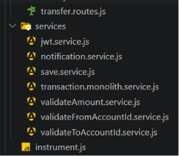
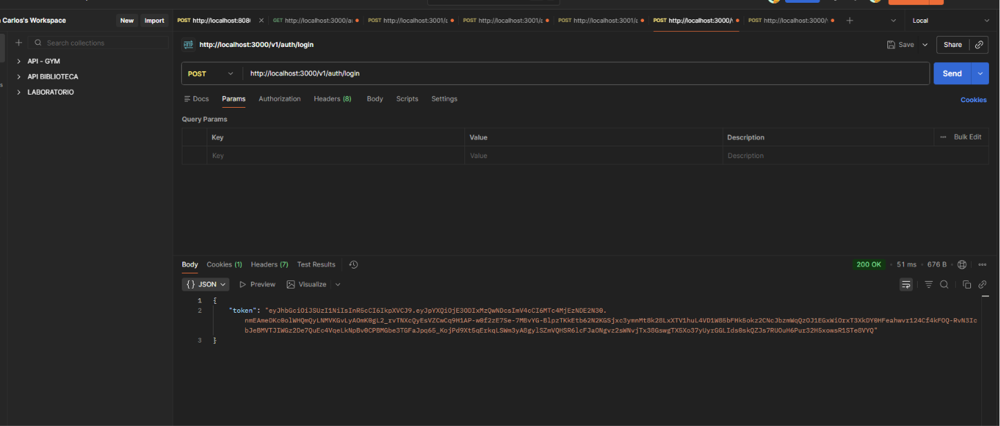
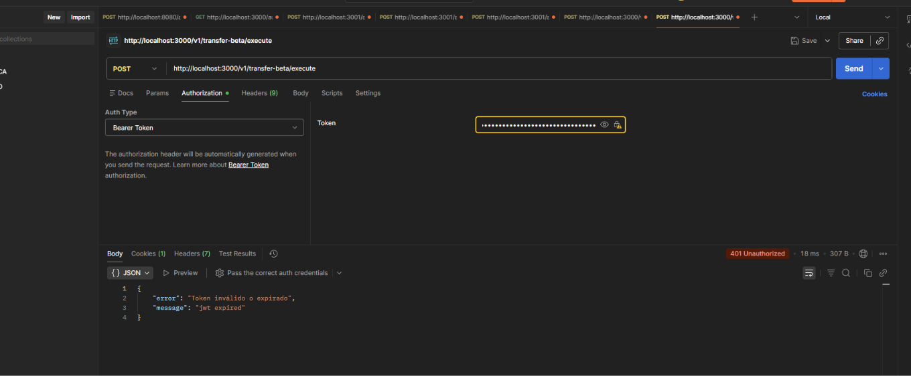
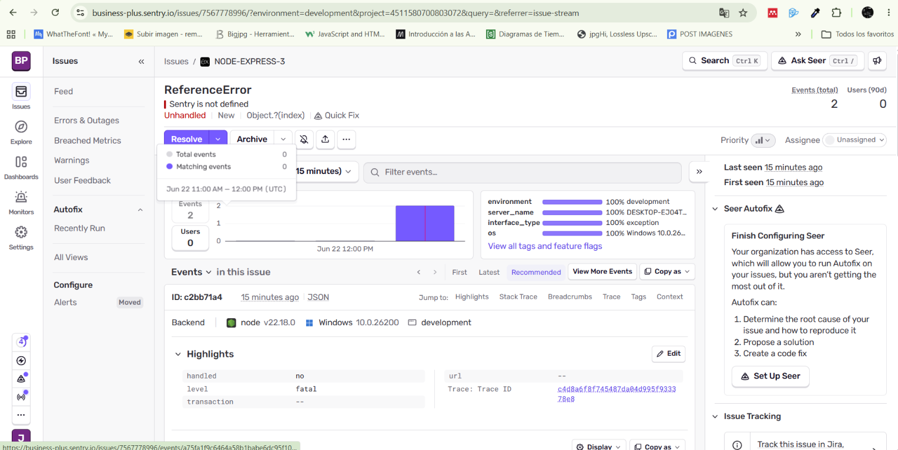
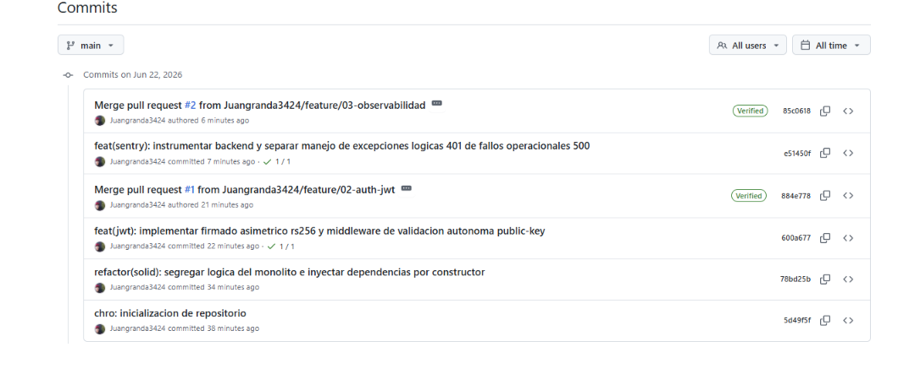

# C1: Refactorización SOLID (SRP & DIP)

Refactorización de la arquitectura del monolito para cumplir con los principios SOLID, específicamente el Principio de Responsabilidad Única (SRP) y el Principio de Inversión de Dependencias (DIP). Esto implica separar las responsabilidades en clases y módulos distintos, y depender de abstracciones en lugar de implementaciones concretas.

# C2: Autenticación Stateless (JWT RS256)

Autenticacion de Login utilizando JWT con algoritmo RS256, lo que permite un sistema de autenticación sin estado (stateless) y más seguro. Esto mejora la escalabilidad y la seguridad del sistema al no depender de sesiones almacenadas en el servidor.

Validadcion de envio de token JWT en cada request a los endpoints del monolito, asegurando que solo usuarios autenticados puedan acceder a los recursos protegidos.

# C3: Observabilidad y Sentry Tracking

Ingreso de Sentry para el tracking de errores y excepciones en el monolito, lo que permite una mejor observabilidad y monitoreo del sistema. Esto facilita la identificación y resolución de problemas en producción.

# C4: GitOps y Trazabilidad DevOps

Commits y trazabilidad de cambios en el monolito, siguiendo buenas prácticas de GitOps y DevOps. Esto permite un mejor control de versiones y facilita la colaboración entre desarrolladores.

